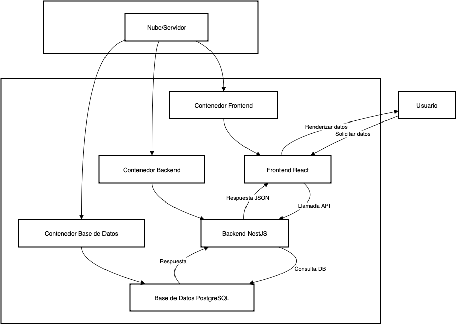
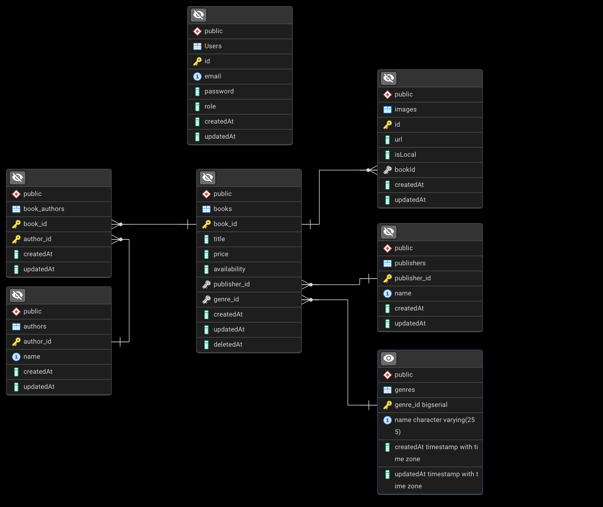

# CMPC Libros
# Repositorios de Submódulos

Accede directamente a los repositorios de los submódulos:

- [cmpc-libros-back (NestJS)](https://github.com/crisisfb/cmpc-libros-back)
- [cmpc-libros-front (React/Vite)](https://github.com/crisisfb/cmpc-libros-front)
## Descripción

CMPC Libros es una plataforma integral para la gestión de libros, autores, géneros y usuarios. Pensada para bibliotecas, editoriales o proyectos personales, permite administrar colecciones de libros, registrar autores, organizar géneros y gestionar usuarios de manera eficiente.

El sistema está compuesto por un backend desarrollado en NestJS, un frontend moderno en React/Vite y una base de datos PostgreSQL, todo desplegado fácilmente mediante Docker Compose. Incluye documentación interactiva de la API para facilitar la integración y el desarrollo.

## Documentación de la API

El backend expone una documentación interactiva de la API REST utilizando Swagger. Puedes acceder a ella desde:

- [http://localhost:3001/api](http://localhost:3001/api)

Esta documentación te permite explorar los endpoints disponibles, probar peticiones y consultar los modelos de datos utilizados por la aplicación.

## Arquitectura y Decisiones de Diseño

- **Backend:** NestJS (TypeScript) para una API robusta y escalable.
- **Frontend:** React + Vite para una interfaz moderna y rápida.
- **Base de datos:** PostgreSQL, elegida por su fiabilidad y soporte avanzado para datos relacionales.
- **Orquestación:** Docker Compose permite levantar todo el stack con un solo comando, facilitando el desarrollo y pruebas locales.
- **pgAdmin:** Herramienta gráfica para administrar la base de datos.
- **Separación de carpetas:** El frontend y backend están desacoplados para facilitar el mantenimiento y despliegue independiente.

---

## Instalación y Configuración

### Requisitos previos
- Docker y Docker Compose instalados.

### Pasos
1. Clona el repositorio:
   ```bash
   git clone https://github.com/crisisfb/CMPC-libros
   cd cmpc-libros
   ```

   ---

   ## Diagramas del Sistema

   ### Diagrama de Arquitectura

   El siguiente diagrama muestra la arquitectura general del sistema, incluyendo los principales componentes y su interacción:

   

   ---

   ### Diagrama Relacional

   El modelo relacional de la base de datos está diseñado para gestionar libros, autores, géneros, editoriales y usuarios:

   

   Puedes ver la descripción detallada en [`modelo-relacional.md`](./modelo-relacional.md).
2. Configura los archivos `.env` en `cmpc-libros-back` y `cmpc-libros-front` según tus necesidades. Ejemplo:
   - `cmpc-libros-back/.env`
   - `cmpc-libros-front/.env`
3. Levanta el stack completo:
   ```bash
   docker-compose up --build
   ```
4. Accede a los servicios:
   - **Frontend:** [http://localhost:5173](http://localhost:5173)
   - **Backend:** [http://localhost:3001](http://localhost:3001)
   - **pgAdmin:** [http://localhost:5050](http://localhost:5050)

---

## Guía de Uso

1. Ingresa al frontend y regístrate o inicia sesión.
2. Gestiona libros, autores, géneros y usuarios desde la interfaz.
3. Administra la base de datos desde pgAdmin si lo requieres.

---

## Notas Adicionales

- El frontend consume la API del backend y muestra los datos en tablas y formularios interactivos.
- Puedes modificar la configuración de puertos en el archivo `docker-compose.yml` si lo necesitas.
